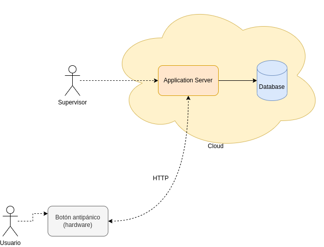

# Ejercicio CiberKillChain - Ataque

## Alumno

Erik Hromek

## Enunciado

Armar una cyberkillchain usando técnicas de la matriz de Att&ck para un escenario relacionado al trabajo práctico de la carrera.

  

## Datos trabajo práctico

El sistema a atacar es ficticio, está basado en uno de los componentes de mi trabajo final (diseño de un dispositivo físico) y una plataforma web usada en mi trabajo, pero no refleja la realidad 100% de cómo está implementado en la práctica, por detalles internos y sensibilidad de la información, y porque además todavía no comencé con el trabajo final.

.

El sistema consiste en una plataforma web usada para la prevención ciudadana. Se entrega a los beneficiarios botones antipánico (dispositivo físicos) que están conectado al componente web (*cloud*) de la solución. Cuando la persona presiona el botón manda un alerta a la plataforma web y esta es gestionada por las autoridades de seguridad de un centro de monitoreo, disparando acciones (enviando a la policía, contactando a la persona, etc.). 

Este sistema se implementa tanto en municipios, como empresas de seguridad privadas.

## Resolución

### Objetivo del ataque
El objetivo del ataque es hacer perder las elecciones a un municipio, generando descontento en la gente y revuelo en los medios de comunicación locales para afectar la reputación de las autoridades actuales. Para esto se intentará vulnerar el correcto funcionamiento del sistema de emergencias.

Hay dos formas posibles: 

- Hacer que los supervisores no se enteren de las alertas y no puedan atender las situaciones de emergencia;
- Generar información falsa (por ejemplo cambiar las ubicaciones de las alertas) para que no puedan operar correctamente.

Considero que el primer caso es más viable de sostener en el tiempo, ya que información falsa levantará sospechas más rápidos de que la plataforma está fallando.

### Pasos del ataque

1. Reconnaissance (obtener información que servirá para planes futuros)
  
Se desea obtener las credenciales del usuarios supervisores, que son los que realizan las acciones pertinentes ante una emergencia. Las técnicas a usar serán:

- [T1591 - Gather Victim Org Information](https://attack.mitre.org/techniques/T1591/)
- [T1593 - Search Open Websites/Domains](https://attack.mitre.org/techniques/T1593)
- [T1594 - Search Victim-Owned Websites](https://attack.mitre.org/techniques/T1594)
- [T1596.005 - Scan Databases](https://attack.mitre.org/techniques/T1596/005/)

Se buscará información disponible públicamente sobre (siguiendo las 4 técnicas listadas):

- quienes son los empleados y usuarios de la aplicación dentro del municipio
- cómo se usa la plataforma, que información se tiene disponible por parte de la empresa que provee el servicio (demos, guías, manuales, etc.) para pararse del lado del usuario: 
- comunicaciones/notificaciones de la empresa a los clientes/usuarios, cómo es la estrategia de comunicación para copiarla luego (para un intento de phishing)
- bases de datos comprometidas, disponibles en internet que tengan información, posibles credenciales de los usuarios

2. Weaponization (juntar toda la información para preparar el ataque, y conseguir los recursos necesarios para llevar a cabo el plan):

- [T1583 -  Acquire Infrastructure](https://attack.mitre.org/techniques/T1583/):
   - [T1583.001 - Domains](https://attack.mitre.org/techniques/T1583/001/)
   - [T1583.006 - Web Services](https://attack.mitre.org/techniques/T1583/006/)
   - [T1585.002 - Establish Accounts - Mail Accounts](https://attack.mitre.org/techniques/T1585/002/)

El servicio web se utilizará para generar una login igual al de la plataforma. Se disponibilizará mediante un dominio contratado que sea casi igual al original. El dominio será contratado mediante algún servicio que provea enmascaramiento para ocultar las identidades del encargado del ataque. Se crearán cuentas falsas de mailing para enviar correos con el objetivo de engañar a los usuarios legítimos.

3. Delivery (envío de los recursos creados a la víctima para intentar acceder al sistema):
- [T1566 - Phishing](https://attack.mitre.org/techniques/T1566/)

El método ideal es generar un correo mostrando nuevas funcionalidades, un nuevo release de la plataforma, e invitando a ver las nuevas funcionalidades. 
Se puede realizar el correo siguiendo la misma estética y formato de la empresa legítima, en base a la investigación previa del producto.

4. Exploitation (acceso inicial al sistema):

- [T1078.004 - Valid Accounts](https://attack.mitre.org/techniques/T1078/004/): se usarán las credenciales obtenidas en el paso anterior para acceder al sistema, y hacer un análisis de toda la aplicación web de monitoreo

5. Installation (ejecución del ataque):

- [T1651 - Cloud Administration Command](https://attack.mitre.org/techniques/T1651/): Se accederá con el usuario administrador obtenido, y se tomará control de la plataforma

6. Command & Control (establecer medio para controlar al sistema):

Se duplicarán usuarios, se creará otro usuario administrador con los permisos necesarios para utilizar la aplicación, sin tener que tocar el usuario original.

Para el acceso, se deberá acceder mediante un medio que permita esconder las identidades del atacante y el origen. Puede ser mediante un servidor usado como proxy para conectarse a la plataforma. O una red que permite enmascarar y anonimizar el tráfico.

- [T1090.002 - External proxy](https://attack.mitre.org/techniques/T1090/002/ )
- [T1090.003 - Multihop proxy](https://attack.mitre.org/techniques/T1090/003/)

7. Actions on Objectives (acciones sobre los objetivos del sistema con el propósito original):

Las técnicas a utilizar, siguiendo la matriz de att&ck, pueden ser:

- [T1565 - Data Manipulation](https://attack.mitre.org/techniques/T1565/)
- [T1499 - Endpoint Denial of Service](https://attack.mitre.org/techniques/T1499/)
- [T1531 - Account Access Removal](https://attack.mitre.org/techniques/T1531/)
- [T1485 - Data Destruction](https://attack.mitre.org/techniques/T1485/)

Se llevarán a cabo las siguientes acciones:

- desactivar alertas
- borrar datos de alertas actuales para no ver información más reciente
- cambiar contraseñas/desactivar otros usuarios (no lo recomiendo porque levantaría rápidamente sospechas)
- luego de un tiempo, publicaría los problemas/emergencias no atendidas por el centro de monitoreo/usuarios de la plataforma

Posteriormente, faltaría la parte de dar a conocer o visibilizar los problemas que se tienen ante estas emergencias y la imposibilidad de dar una respuestas a tiempo, pero considero que están por fuera de estas actividades.

---

Como punto, creo que el hecho de obtener un acceso como administrador casi sin llevar a cabo acciones netamente técnica (exploiting. análisis de vulnerabilidades, etc. sobre la plataforma) permitiría a un atacante, analizar mejor internamente como funciona la aplicación:

- qué endpoints tiene;
- como funciona la web;
- cómo obtiene los datos del backend/microservicios

Estoque permitiría más adelante hacer un ataque o comprometer el funcionamiento sin requerir acceder como usuario. 
Se me ocurre enviar datos que realenticen severamente el funcionamiento, o que hagan fallar la webapp.

